# UI Components

The extension contains various UI components which are can be reused if case the distributors wants to modify the UI look and feel.
Following are the details of these reusable components:

## AccountInfo

This component is used to show the details of the Tier Account of the customer 
containing following information:

1. Firstname
2. Lastname
3. Email
4. Phone
5. Company Name
6. Tier Account ID
7. External ID
8. Address Line 1
9. Address Line 2
10. City
11. State/Provision
12. Zip Code
13. Country

***Example:***

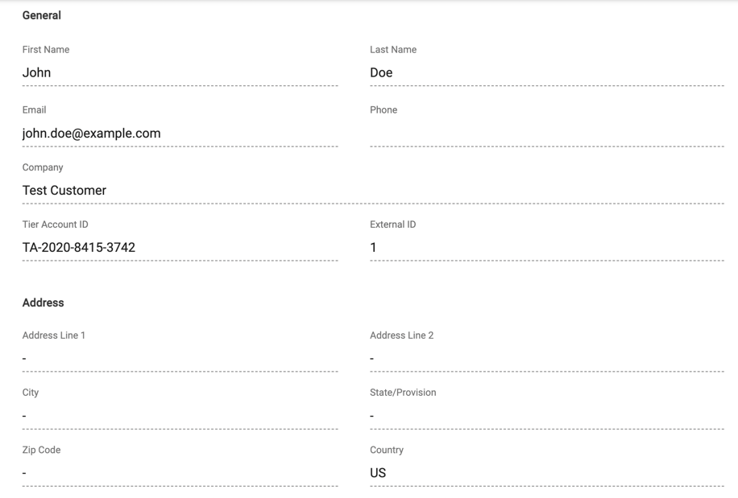

### Properties

#### account

Pass the tier account details from connect to this component to render the property values.

***Adding programmatically:***

```python
...
self.control_panel.add_component(
    AccountInfo(account=account),
)
...
```

## ActiveSubscriptionOptions

This component can be used to show different options for any action subscriptions
 like `Actions`, `Download Links` and `Document Links`

***Example:***

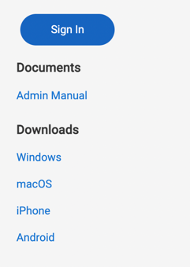

### Properties

#### subscription_id
Subscription ID for which you want to show the options.

#### product_id
Product ID to which the subscription belongs to.

#### actions
List of subscription action objects available for the product from connect platform.

#### download_links
List of download link objects available for the product from connect platform.

#### document_links
List of document link objects available for the product from connect platform.

#### extend_height_to_page_end
Set as `True` if you want to extend the visibility of the component till the end of the page.

### Events

#### action_click
Event will be raised when an action is clicked by the user.

***Event Properties:***
1. action_id: ID of the action which is triggered.
2. product_id: Product ID for which action has been called.
3. subscription_id: Subscription ID for which action has been called.

## HaltedSubscriptionTemplate

`HaltedSubscriptionTemplate` can be used for `terminated` or `suspended` subscriptions.

***Example:***

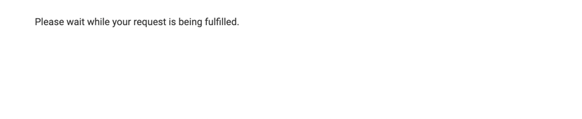

### Properties

#### subscription_status
Pass the status of the subscription as string.

Mandatory: Yes

Default: null

#### show_back_button
Specify `True` if you want to show the back button else `False`

Mandatory: No

Default: `False`

#### terminated_msg
Message to be shown in case the subscription is in terminated status.

Mandatory: No

Default: `Sorry, this service has been terminated. Go to your account to manage your subscriptions.`


#### suspended_msg
Message to be shown in case the subscription is in suspended status.

Mandatory: No

Default: `Sorry, this service is unavailable at the moment.`

#### extend_height_to_page_end
Set as `True` if you want to extend the visibility of the component till the end of the page.

Mandatory: No

Default: `False`


## ItemList
This component is used to show the list of items available for a subscription.


***Example:***

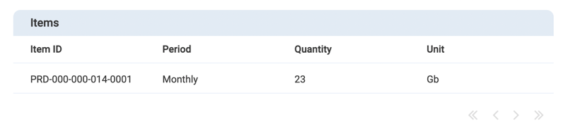

### Properties

#### subscription_items
Pass on the list of items from subscription from connect.

Mandatory: Yes

Default: null

#### header
Header string to placed on top of item table.

Mandatory: No

Default: `Items`

## ProductCard
ProductCard component provides a small overview of the product along
with a capability to show more details about the product based on event.

***Example:***

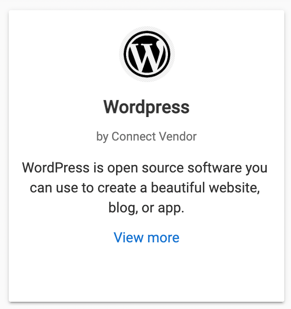

### Properties

#### product
Pass on the product object from connect API.

Mandatory: Yes

Default: null

### Events

#### show_detail
Click event on show short details link on the product card.

***Event Properties:***
1. product: Product for which show detail event has been generated.

## ProductDetail
ProductDetail component shows details about the product along with icon, description, name and provider of the product.

***Example:***

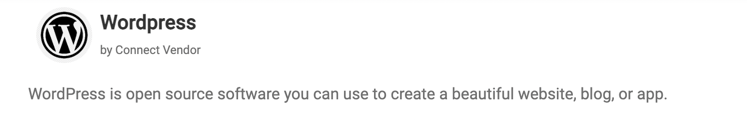

### Properties

#### product
Pass on the product object from connect API.

Mandatory: Yes

Default: null

### Events

#### show_details
Click event on show short details link on the product card.

***Event Properties:***
1. product: Product object for which the details need to be shown.

## ProductMenuItem
This component is used as single entry for the product list menu for specific product. It shows icon, name and provider.

***Example:***

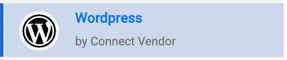

### Properties

#### product
Pass on the product object from connect API.

Mandatory: Yes

Default: null

### Events

#### show_detail
On click event on the menu item to show details of the product.

***Event Properties:***
1. product: Product object for which detail need to be shown.

## ProductListMenu
This component is used as menu containing list of `ProductMenuItem` belonging to each product.

***Example:***

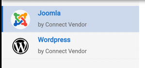

### Properties

#### products
List of product objects from connect API.

Mandatory: Yes

Default: null

### Events

#### show_details
Show details of the product for which the event has been triggered.

***Event Properties:***
1. product: Product object for which the event has been triggered.

## StatusProgressBar
This component is used for subscriptions in transitional status to show the progress bar for the transition.

***Example:***

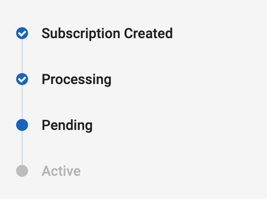

### Properties

#### subscription_status
Put status of the subscription.

Mandatory: Yes

Default: null

## SubscriptionList
This component can be used to present list of subscriptions available for a product.

***Example:***

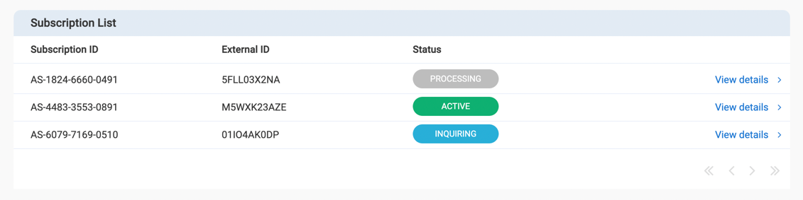

### Properties

#### subscriptions
List of subscription objects from connect.

Mandatory: Yes

Default: null

### Events

#### show_subscription_detail
This event will be triggered when the use clicks on the show detail link.

***Event Properties:***
1. subscription: Subscription object for which show details has been requested.

## SubscriptionProperties
SubscriptionProperties component is used to show details of the subscriptions 
object in normalized manner. This component is very useful during development process.

***Example:***

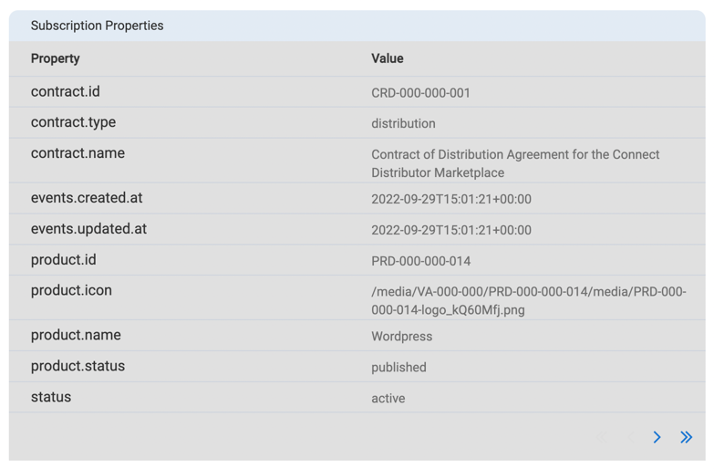

### Properties

#### subscription
Pass on the subscription object from connect whose properties need to be shown.

Mandatory: Yes

Default: null


## SubscriptionShort
This component is for show short details about the subscriptions containing following
properties:

1. Product ID
2. Subscription ID
3. External ID
4. Subscription Status

***Example:***

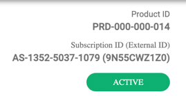

### Properties

#### subscription
Pass on the subscription object from connect whose properties need to be shown.

Mandatory: No

Default: null

#### product_id
Product ID for which the subscription belongs to.

Mandatory: Yes

Default: null

#### align
Possible values are `left` or `right`. This indicates the alignment of the elements included on component.

Mandatory: No

Default: `right`