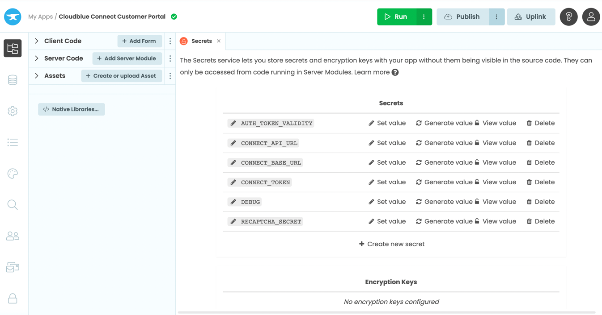
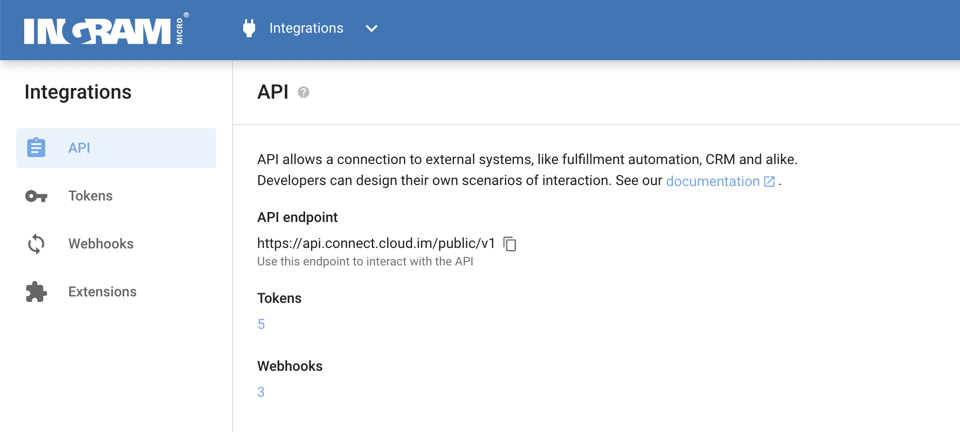

# Configuration for Anvil cloud deployment

## Configure 'Secrets'

1. Open Secrets
2. Put values for different secrets available on the page.



### AUTH_TOKEN_VALIDITY
This secret is used to specify the token validity in minutes send for login into the portal.

### CONNECT_API_URL
Specify the API url from the Cloudblue Connect Portal for which you are deploying the customer portal.
You can get the value from Connect Portal by navigating to the page as `Integrations` -> `API`



### CONNECT_BASE_URL

Specify the URL of to Connect Portal that you use to access connect.


***Note*** Specify only the initial url. In above image it is `https://connect.cloud.im/`

### CONNECT_TOKEN
Generate a new token for the customer portal in Clodublue Connect Portal and put the value as this secret.

### DEBUG
Possible Values:
1. True
2. False

Set this value as `True` during development to display some extra information (Subscription Properties).

### RECAPTCHA_SECRET

Description about this secret can be found on [Configure Recaptcha Page](recaptcha.md)


# Configuration for docker deployment

For docker deployment, the configurations are passed through `config.yml` present in directory `settings`.

```yml
secret:
  CONNECT_BASE_URL: ''
  CONNECT_API_URL: ''
  CONNECT_TOKEN: ''
  AUTH_TOKEN_VALIDITY: '10'
  DEBUG: 'False'
  RECAPTCHA_SECRET: ''
port: '8080'
database: 'jdbc:postgresql://db/customer?user=postgres&password=1q2w3e'
smtp-host: ''
smtp-port: ''
smtp-encryption: 'ssl'
smtp-username: '{smtp_username}'
smtp-password: '{smtp_password}'
```

Specifications of different secrets are specified above `Configuration for Anvil cloud deployment`.

### port
Specify the port number on which server will run. Default is `8080` which leads to explore the customer portal on `http:\\localhost:8080`.

### database
Specify the database url to be connected as storage. By default, it will connect to DB provided by docker container db.

### SMTP Configurations
Email service is needed to configure sent OTP for the purpose of login. 